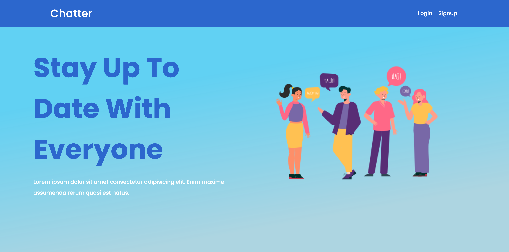
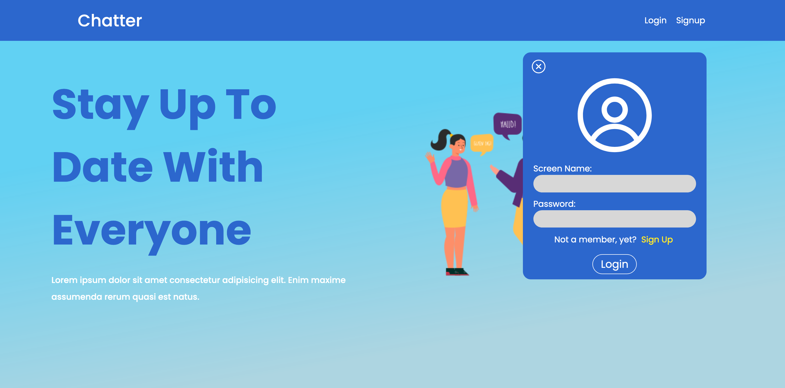
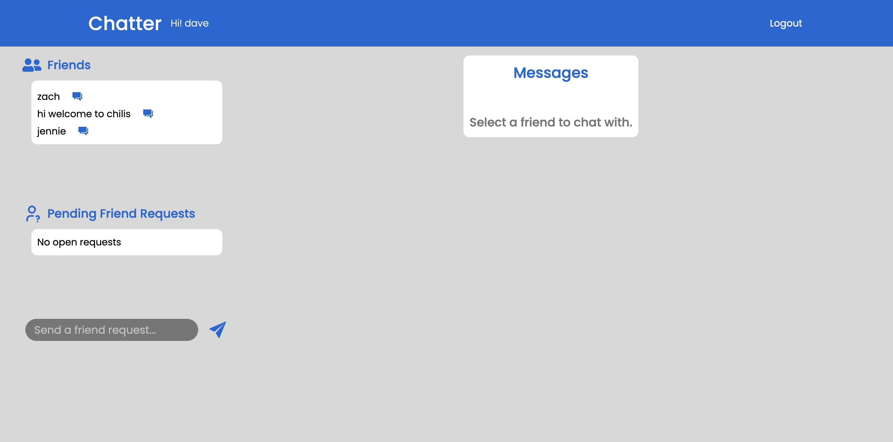
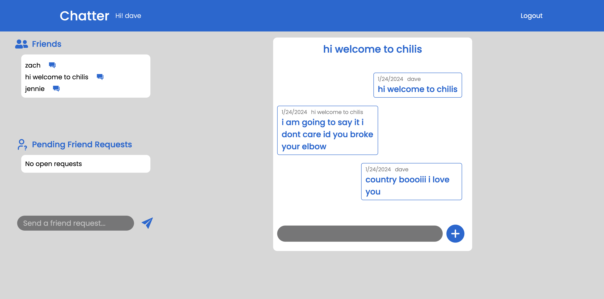

# Chat App

Chat application built using React, Express / Nod.js, and MongoDB. Features include JSONWebToken and password encryption and web sockets.

Frontend
- React backend with routing from react-router-dom. Websocket client is installed to handle message communications on the frontend.

Backend:
- Node.js / Express is used to create the backend. Passwords are encrypted with bcrypt and tokens are used for authorizations with jsonwebtoken. Websockets are used to handle message communications on the backend.

Homepage

Auth

User Landing

Messages
